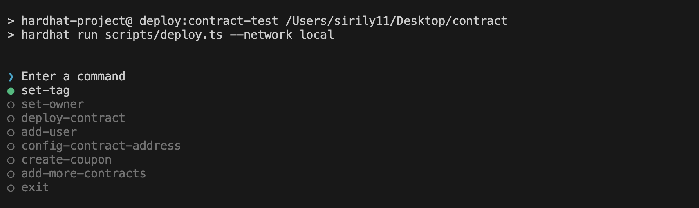

# Axiom Consumption Coupon Contract

[](https://codecov.io/github/meta-metopia/axiom-coupon-contract)

[](https://github.com/meta-metopia/axiom-coupon-contract/actions/workflows/main.yaml)

This is a smart contract for the Axiom Consumption Coupon. The contract is written in Solidity and is deployed on the Axiomesh blockchain.

## Getting Started

## Deployment

We have a well designed cli for contract interactions



1. Create `.env` file with the following content:

```bash
PRIVATE_KEY=
# optional
UPSTASH_REDIS_REST_URL=
# optional
UPSTASH_REDIS_REST_TOKEN=
```

2. Run the following command to deploy the contract to deployed to the Axiomesh blockchain:

```bash
pnpm deploy:contract
```

or

```bash
pnpm deploy:contract-test
```

to deploy to the local testnet.

> Side note: You can decide the storage for your smart contract by changing the storage class in the deploy script.

```typescript
const localStorage = new LocalStorage("storage_data.json");
const upstashStorage = new UpstashStorage();
```

## Testing

Run the following command to run the tests:

```bash
pnpm test
```

Tests are located in the `test` directory.
